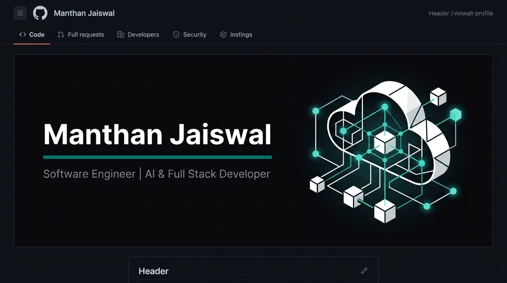

 

## Building AI Systems • Enterprise SaaS • Computer Vision

**Software Engineer | AI & Full Stack Developer**

I am focused on building production-grade AI applications, enterprise SaaS platforms, and multimodal systems with a deep emphasis on real-world engineering and scalable architecture.

  
  

  
  
  

---

## 🚀 Current Focus

- Building enterprise-grade AI platforms
- Developing multimodal computer vision systems
- Designing scalable SaaS architectures
- Exploring agentic AI and autonomous workflows

## 💡 Engineering Philosophy

I enjoy building software that is:
- **Scalable**
- **Reliable**
- **Maintainable**
- **User-centric**
- **Production-ready**

---

## ⭐ Flagship Project

### [🌊 AquaSync](https://github.com/Manthan-13521/AquaSync-Showcase)

> **Note:** Production implementation is maintained in a private repository. This links to the public architectural showcase.

**Production-grade multi-tenant SaaS for swimming pools, hostels, and businesses.**

Engineered for high reliability with a strict distributed architecture. Features real-time billing idempotency (`LedgerCycle` distributed locks), circuit breakers (`opossum`) for external payment gateways, and a Dead-Letter Queue for webhook replay.

**Tech Stack:** `Next.js 16` • `MongoDB` • `Redis` • `Razorpay` • `Twilio`  
[Explore Showcase](https://github.com/Manthan-13521/AquaSync-Showcase) · [Live Demo](https://modern-businesses-management.vercel.app/)

 

## 🌟 Featured Projects

| Project | Value Proposition | Tech Stack | Links |
|:---|:---|:---|:---|
| **🤖 [AION OS](https://github.com/Manthan-13521/Jarvis-AI-Assistant)** | Multimodal AI assistant mimicking an OS interface for complex task execution. | `Python` `OpenAI` `WebSockets` | [Repo](https://github.com/Manthan-13521/Jarvis-AI-Assistant) |
| **⌨️ [PinchType](https://github.com/Manthan-13521/PinchType-Virtual-Keyboard)** | Virtual keyboard driven by computer vision and hand-tracking gestures. | `Python` `OpenCV` `MediaPipe` | [Repo](https://github.com/Manthan-13521/PinchType-Virtual-Keyboard) |
| **✍️ [VisionInk](https://github.com/Manthan-13521/VisionInk-Hand-Tracking)** | Hand-tracking application for digital drawing and real-time canvas interaction. | `Python` `OpenCV` `MediaPipe` | [Repo](https://github.com/Manthan-13521/VisionInk-Hand-Tracking) |
| **🚗 [GestureKart](https://github.com/Manthan-13521/GestureKart-AI-Racing)** | AI-powered racing game controlled entirely by spatial hand gestures. | `Python` `Pygame` `OpenCV` | [Repo](https://github.com/Manthan-13521/GestureKart-AI-Racing) |
| **🍽️ [RestoOS](https://github.com/Manthan-13521/RestoOS-Enterprise-Platform)** | Enterprise platform for restaurant management and multi-channel order routing. | `React` `Node.js` `PostgreSQL` | [Repo](https://github.com/Manthan-13521/RestoOS-Enterprise-Platform) |

---

## 💻 Tech Stack

- **Languages:** TypeScript, JavaScript, Python, C++, SQL
- **Frontend:** React, Next.js (App Router), Tailwind CSS, Framer Motion
- **Backend:** Node.js, Express.js, WebSockets, REST APIs
- **AI / Computer Vision:** OpenAI APIs, OpenCV, MediaPipe
- **Databases & Cache:** MongoDB Atlas, PostgreSQL, Upstash Redis
- **Cloud & DevOps:** Vercel, GitHub Actions, Docker, Sentry
- **Tools:** Git, Postman, Figma, Linux/Unix

---

## 🌱 Currently Exploring

- Multi-Agent AI
- Enterprise AI Security
- Computer Vision
- Distributed Systems

---
